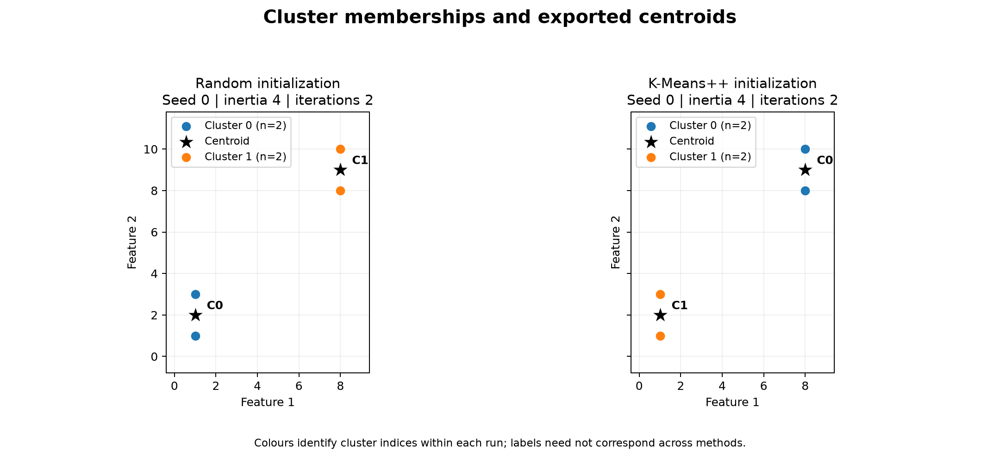
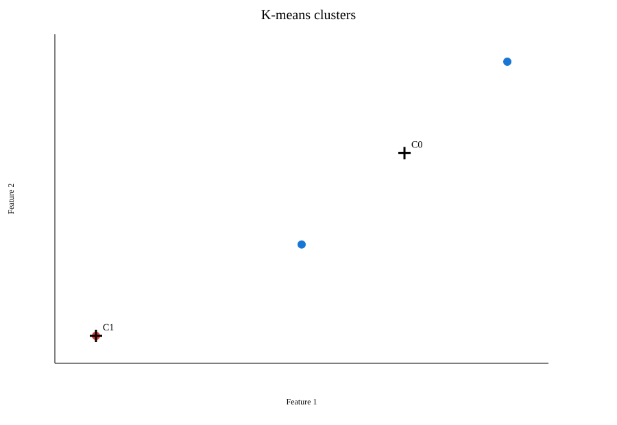
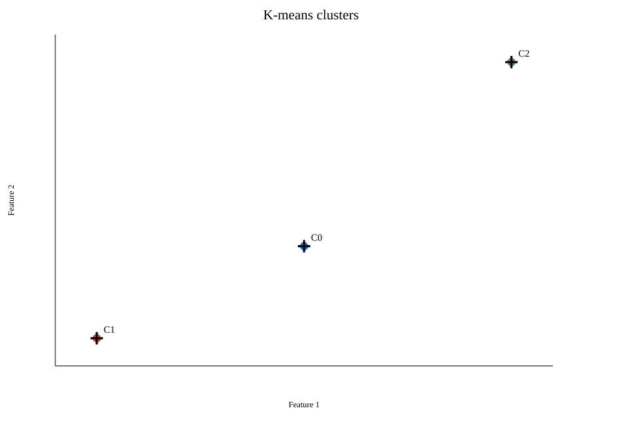
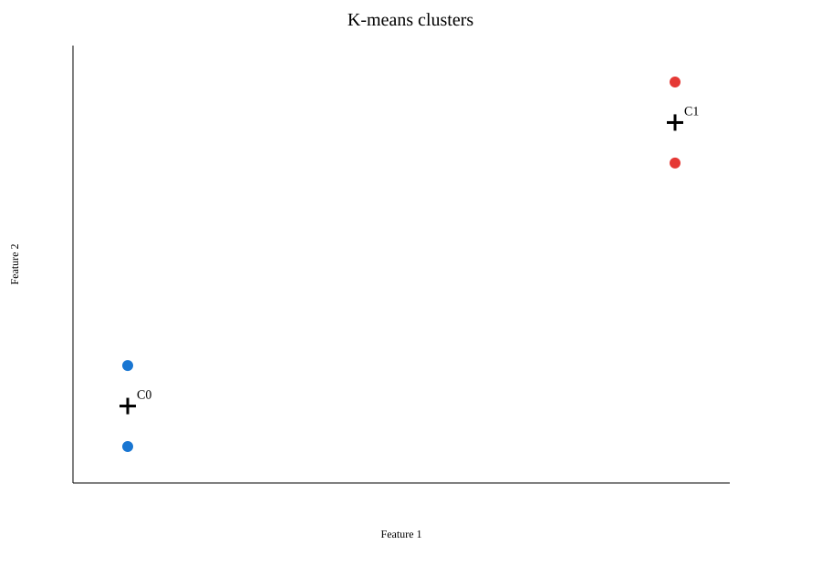
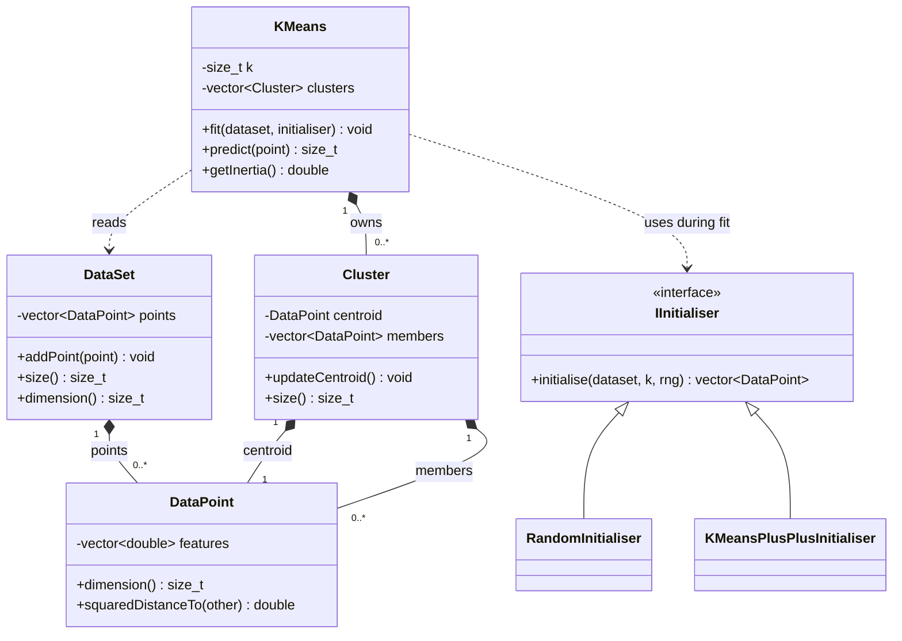

# MiniCluster ? K-Means Clustering

A C++17 project that groups **unlabeled numerical data** into **k clusters**.
It prints the **final centroids and cluster sizes**, and exports the results
for inspection. Supports CSV/JSON input, random and K-Means++ initialization,
and a guided terminal menu.

## Quick start

Requires a C++17 compiler; the commands below use **g++**. GNU Make is optional.
Run from the project directory.

```sh
make run
```

Or build and run directly in PowerShell:

```powershell
g++ -std=c++17 -Wall -Wextra -Wpedantic -Iinclude DataPoint.cpp DataSet.cpp Cluster.cpp RandomInitialiser.cpp KMeansPlusPlusInitialiser.cpp KMeans.cpp CsvIO.cpp JsonIO.cpp SvgPlot.cpp CommandLine.cpp main.cpp -o MiniCluster.exe
.\MiniCluster.exe
```

The JSON library is included in `include/nlohmann/json.hpp`; no download is needed.

| Menu option | Action |
| --- | --- |
| 1 | Start a guided analysis |
| 2 | Show command-line help |
| 3 | Exit |
| 4 | Run the included four-point demo |
| 5 | Explain K-means, settings and data formats |

Choose **4** for a quick demonstration. In guided setup, **Enter** accepts the
suggested value and **`/back`** cancels. Invalid answers can be corrected at the
same prompt. Defaults: k=2 (1 for a single point), K-Means++, seed 42,
100 iterations, and tolerance 0.000001. An unused output folder is suggested.

## Input data

**CSV:** one point per row, numerical features only, without a header.
All rows must have the same number of features. Blank lines are ignored;
empty fields, text and non-finite numbers are rejected.

```csv
1,1
1,3
8,8
8,10
```

**JSON:** a nonempty `points` array of numerical rows. Use a `.json` extension.

```json
{"points": [[1, 1], [1, 3], [8, 8], [8, 10]]}
```

Use the included `sample.csv` or `sample.json`, or prepare your own data.
For **Mall Customers**, select numerical features such as annual income and
spending score; remove the header, customer IDs and text columns. Scale features
before importing when their units or ranges differ substantially. MiniCluster
does not automatically encode categories or scale features.

## Results

The sample demo produces these centroids and sizes; cluster labels may be permuted:

```text
Cluster 0: centroid (1,2), size 2
Cluster 1: centroid (8,9), size 2
```

The report also includes inertia, iteration count and stopping reason.
**Inertia** is the sum of squared distances from points to their assigned
centroids; lower values mean a tighter fit for the same dataset and k.

| Output | Contents |
| --- | --- |
| `centroids.csv` | Cluster index, centroid coordinates and size |
| `assignments.csv` | Each input point and its cluster index |
| `summary.txt` | Run configuration, inertia and stopping information |
| `results.json` | Centroids, members, sizes, inertia and iteration count |
| `clusters.svg` | Scatter plot for data with at least two features |

Each run requires a **new output folder**. Cluster indices start at **0**.
Plot features are numbered from **1**; select two different features in the menu.
A plot of higher-dimensional data shows only the selected two-feature projection.

## Graph gallery

Start with the **method comparison**, then view the **sample result** and
**3D examples** below. Click any graph to open it at full size. All figures are
saved results; you do not need to run the program to view them.

**Reading the graphs:** coloured dots are input points; colours identify clusters
within that run. Black crosses (SVG examples) or stars (comparison) mark centroids.
`C0`, `C1`, etc. are cluster indices, not category names. Colours and indices can
change between runs even when the grouping is identical.

### 1. Random vs K-Means++ ? same grouping, different labels

[](experiments/results/sample-comparison/clusters.png)

**What it shows:** both methods find the same two groups in `sample.csv` at seed 0.
Each group has two points; centroids are (1,2) and (8,9). Both runs have inertia 4
and take two iterations. The cluster labels are reversed between panels.
[Open SVG](experiments/results/sample-comparison/clusters.svg) ?
[Read the experiment report](experiments/results/sample-comparison/report.md)

Across **all ten recorded seeds**, both methods have inertia 4. Random averages
2.3 iterations; K-Means++ averages 2.0. These are iteration counts, not timing
measurements, and describe this small dataset only.
[View all 20 runs](experiments/results/sample-comparison/runs.csv) ?
[Reproduce the comparison](experiments/README.md#exact-reproduction-commands-powershell-project-root)

### 2. Basic 2D example ? the assignment deliverable

[](prof-csv-demo/clusters.svg)

**What it shows:** `sample.csv`, k=2, K-Means++, seed 42. Two clusters with sizes
2 and 2; centroids (1,2) and (8,9); inertia 4. X is feature 1 and Y is feature 2.
[Centroids and sizes](prof-csv-demo/centroids.csv) ?
[Run settings](prof-csv-demo/summary.txt)

**Make your own:** start the application and choose **4** for the quick demo,
or choose **1** to load another file. Open `clusters.svg` in the output folder
with a browser after the run.

### 3. Three-dimensional data ? k=2

[](test_run_3/clusters.svg)

**What it shows:** `sample2.csv`, three points, random initialization, seed 42,
k=2. One cluster contains two points with centroid **(2.5,3,3.5)**; the other
contains one point with centroid **(1,1,1)**. Total inertia is 3.
**Only features 1 and 2 are drawn**; fitting and inertia use all three features.
[Full 3D centroids](test_run_3/centroids.csv) ? [Run settings](test_run_3/summary.txt)

### 4. Same three-dimensional data ? k=3

[](user_test_2/clusters.svg)

**What it shows:** the same three points with k=3, random initialization and seed
42. Each point is its own cluster, so every size is 1 and inertia is 0. Centroid
markers overlap the points. This illustrates the effect of increasing k; zero
inertia alone does not establish a useful choice of k. The two recorded runs
also use different tolerances; their full settings are linked.
[Full 3D centroids](user_test_2/centroids.csv) ? [Run settings](user_test_2/summary.txt)

<details>
<summary>More saved graphs: JSON, menu and verification examples</summary>

These repeat the four-point, two-cluster grouping from example 2. They show
saved results from different input paths and checks, rather than new datasets.

**JSON demo:** `sample.json`, K-Means++, seed 42, k=2; inertia 4.
[Run settings](prof-json-demo/summary.txt)

[](prof-json-demo/clusters.svg)

**Guided-menu example:** `sample.csv`, K-Means++, seed 42, k=2;
tolerance 0.0000005; inertia 4. [Run settings](user_test_menu/summary.txt)

[](user_test_menu/clusters.svg)

**JSON verification:** `sample.json`, K-Means++, seed 42, k=2; inertia 4.
[Run settings](json-check-final/summary.txt)

[](json-check-final/clusters.svg)

**CSV verification:** `sample.csv`, K-Means++, seed 42, k=2; inertia 4.
[Run settings](test-results/summary.txt)

[](test-results/clusters.svg)

</details>

`sample-results/` contains older CSV exports without a graph. The local
`meeting2-demo-20261003-212739/` folder contains another copy of the JSON sample
plot; it is currently untracked and is not part of the GitHub gallery.

## Command-line use

All seven positional arguments are required; two plot-feature arguments are optional.

```text
MiniCluster.exe INPUT K METHOD SEED MAX_ITERATIONS TOLERANCE OUTPUT_DIR [X_FEATURE Y_FEATURE]
```

```powershell
.\MiniCluster.exe sample.csv 2 kmeans++ 42 100 0.000001 my-results
.\MiniCluster.exe sample.json 2 random 42 100 0.000001 json-results
.\MiniCluster.exe --help
```

| Setting | Valid values |
| --- | --- |
| K | 1 through the number of input points |
| METHOD | `random` or `kmeans++` |
| SEED | Integer from 0 to 4294967295 |
| MAX_ITERATIONS | Positive integer |
| TOLERANCE | Finite, nonnegative centroid-movement threshold |
| X_FEATURE / Y_FEATURE | Different 1-based feature numbers; default 1 and 2 |

Quote paths containing spaces. Success returns exit code 0; errors return 1
with an explanation. Running without arguments starts the menu.

## Design and UML

Seven classes separate data, clustering and centroid initialization. File I/O,
plotting and the menu are separate functions. The diagram shows the main
relationships and selected members, rather than every method.



**How fitting works:** select initial centroids, assign each point to its nearest
centroid, then update each centroid to the mean of its members. Repeat until
maximum centroid movement is within tolerance or the iteration limit is reached.

**Decisions to discuss:**

- The initializer interface lets both strategies use the same `fit()` algorithm.
- Random initialization samples distinct input indices; K-Means++ chooses later
  centres using squared-distance weights.
- Distance ties choose the lowest cluster index; empty clusters keep their centroid.
- Results preserve the last completed assignment/update iteration. If stopped
  early, a later `predict()` call can differ from a stored assignment.
- A fixed seed supports repeatable runs in the same implementation. Different
  starts can give different results; K-means does not guarantee a global optimum.

The interface class is `IInitialiser`; its existing filename is `IInitializer.h`.

## Verification and further documentation

```sh
make check
```

This builds/runs the C++ tests and runs the CLI and menu integration checks.
Python 3 is required for the integration scripts; they use the standard library.

- [Design decisions](DESIGN.md) ? detailed implementation and milestone history.
- [Testing record](TESTING.md) ? executed checks, coverage and remaining limits.
- [Initializer experiments](experiments/README.md) ? compare methods across seeds.
- [AI usage](AI_USAGE.md) ? project assistance record.
